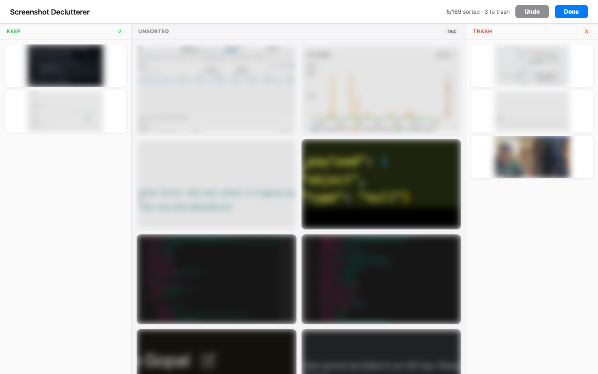
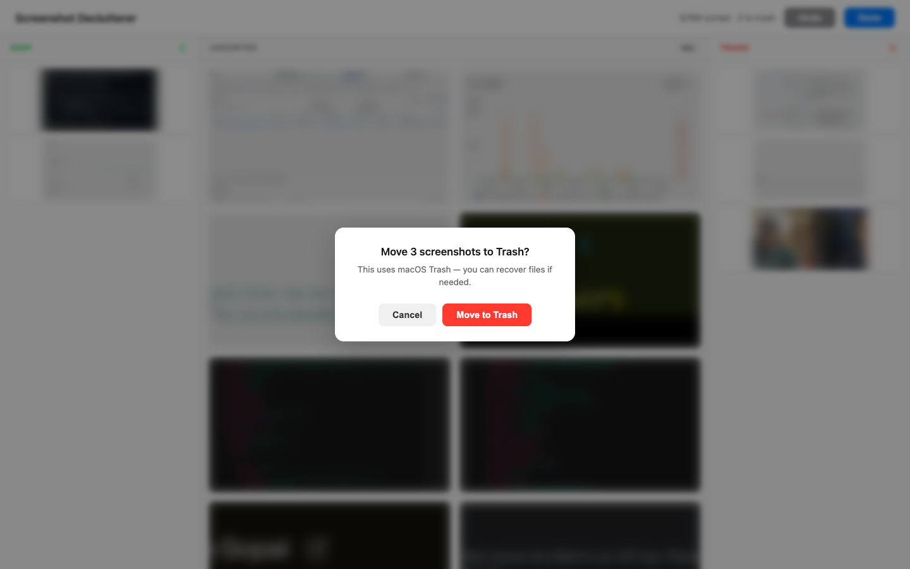

# Screenshot Declutterer

> Quickly sort and trash the screenshots cluttering your macOS Desktop.


<p align="center">
  
</p>

Screenshot Declutterer opens a local webpage that displays every `Screenshot*.png` on your Desktop as a draggable card. Drag left to **Keep**, right to **Trash**. When you're done, confirm and the trashed files move to macOS Trash (recoverable).

Nothing leaves your machine — the entire app runs locally.

## Features

- **Kanban-style sorting** — three-column layout (Keep / Unsorted / Trash) with drag-and-drop
- **Keyboard shortcuts** — arrow keys, `Cmd+Z` undo, `Esc` to close previews
- **Full-size preview** — double-click any card or hit "Preview" for a lightbox view
- **Undo support** — global undo button + per-card undo once sorted
- **Safe delete** — files go to macOS Trash via [`send2trash`](https://github.com/arsenetar/send2trash), never permanently deleted
- **Confirmation dialog** — always asks before trashing

<p align="center">
  
</p>

## Quick Start

### Prerequisites

- macOS
- Python 3.9+
- [uv](https://docs.astral.sh/uv/) (recommended) or pip

### Install & Run

```bash
git clone https://github.com/Collaboration95/screenshot-declutterer.git
cd screenshot-declutterer
make install
make run
```

Your browser opens automatically at `http://localhost:5001`.

## Keyboard Shortcuts

| Key | Action |
|-----|--------|
| `Arrow Left` | Move focused card to Keep |
| `Arrow Right` | Move focused card to Trash |
| `Cmd/Ctrl + Z` | Undo last action |
| `Esc` | Close lightbox / modal |
| `Double-click` | Open full-size preview |

## How It Works

1. **Scans** `~/Desktop` for files matching `Screenshot*.png` (top-level only)
2. **Serves** thumbnails via a local Flask server — nothing leaves your machine
3. **Sorts** via vanilla JS drag-and-drop in the browser
4. **Trashes** using `send2trash`, which calls the native macOS Trash API

## Tech Stack

- **Backend:** Python / Flask
- **Frontend:** Vanilla HTML, CSS, JavaScript (no build step)
- **Linting:** Ruff + Pyright
- **Testing:** pytest

## Development

```bash
make dev        # Install dev dependencies
make test       # Run tests
make lint       # Lint with Ruff
make typecheck  # Type-check with Pyright
make check      # Run all checks (lint + typecheck + tests)
```

Run `make` or `make help` to see all available targets.

## License

MIT — see [LICENSE](LICENSE).
