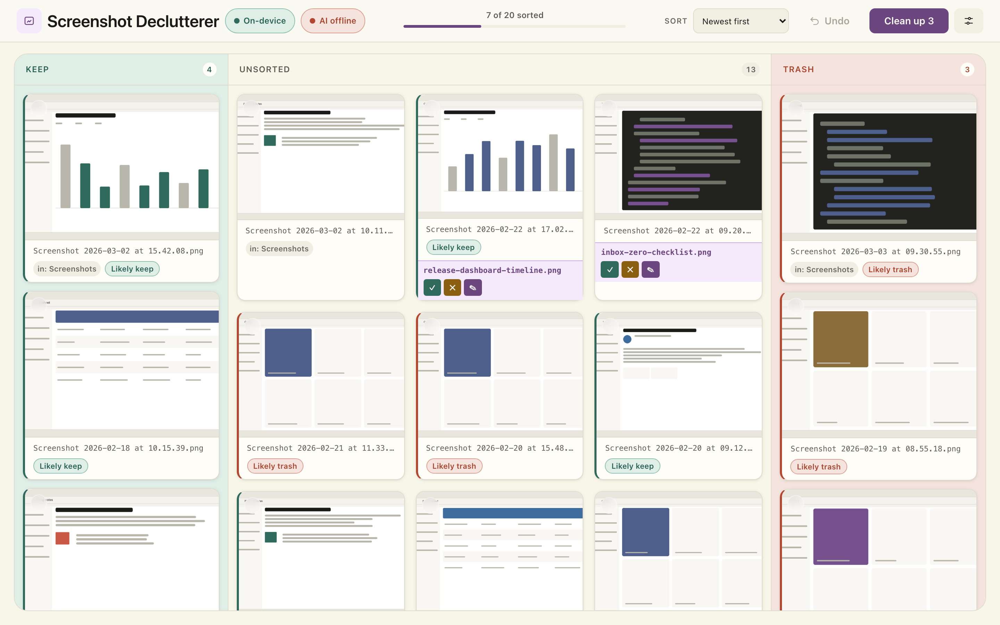
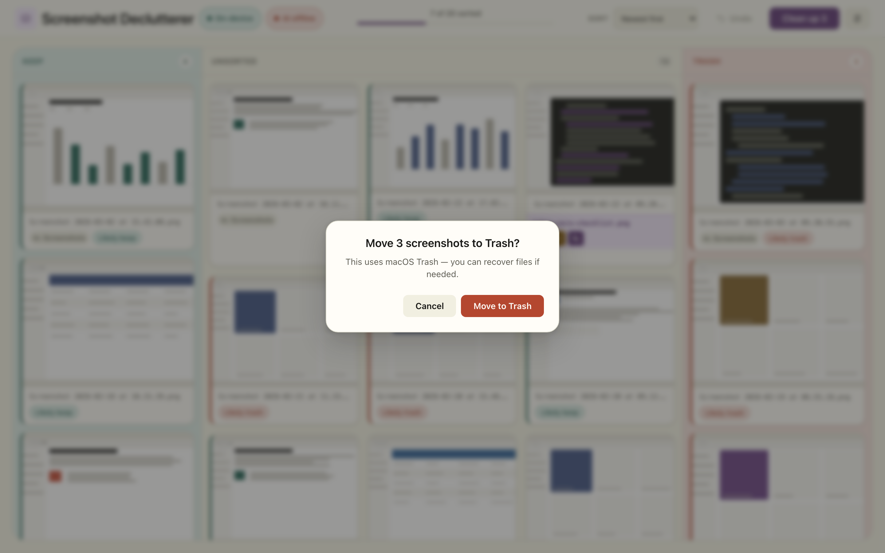

# Screenshot Declutterer

> Quickly sort and trash the screenshots cluttering your macOS Desktop.


<p align="center">
  
</p>

Screenshot Declutterer opens a local webpage that displays every `Screenshot*.png` (and `.jpg`, `.jpeg`, `.tiff`, `.bmp`) on your Desktop as a draggable card. Drag left to **Keep**, right to **Trash**. When you're done, confirm and the trashed files move to macOS Trash (recoverable).

Nothing leaves your machine — the entire app runs locally.

## Features

- **Kanban-style sorting** — three-column layout (Keep / Unsorted / Trash) with drag-and-drop
- **Rename screenshots** — click "Rename" on any card to rename files directly from the UI
- **Keyboard shortcuts** — arrow keys, `Cmd+Z` undo, `Esc` to close previews
- **Full-size preview** — double-click any card or hit "Preview" for a lightbox view
- **Undo support** — global undo button + per-card undo once sorted
- **Safe delete** — files go to macOS Trash via [`send2trash`](https://github.com/arsenetar/send2trash), never permanently deleted
- **Confirmation dialog** — always asks before trashing
- **Port flexibility** — automatically finds a free port if the default (5002) is occupied; set `SS_DCL_PORT` to override
- **Multi-format support** — scans for PNG, JPG, JPEG, TIFF, and BMP screenshots

See [backlog-features.txt](backlog-features.txt) for features under development.

<p align="center">
  
</p>

## Quick Start

```bash
git clone https://github.com/Collaboration95/screenshot-declutterer.git
cd screenshot-declutterer
make install
make run
```

Your browser opens automatically at `http://localhost:<port>` (default 5002, auto-incremented if occupied).

## Environment Variables

| Variable | Default | Description |
|----------|---------|-------------|
| `SS_DCL_PORT` | `5002` (auto) | Override the server port. Set `0` to auto-detect. |
| `SS_DCL_DESKTOP` | `~/Desktop` | Override the directory to scan for screenshots |
| `THUMB_SIZE` | `400x300` | Thumbnail dimensions in `WxH` format |
| `FLASK_DEBUG` | `0` | Enable Flask debug mode (`1` to enable) |

## Keyboard Shortcuts

| Key | Action |
|-----|--------|
| `Arrow Left` | Move focused card to Keep |
| `Arrow Right` | Move focused card to Trash |
| `Cmd/Ctrl + Z` | Undo last action |
| `Esc` | Close lightbox / modal |
| `Double-click` | Open full-size preview |

## How It Works

1. **Scans** `~/Desktop` for files matching `Screenshot*.*` with supported image extensions (PNG, JPG, JPEG, TIFF, BMP; top-level only)
2. **Serves** thumbnails via a local Flask server — nothing leaves your machine
3. **Sorts** via vanilla JS drag-and-drop in the browser
4. **Trashes** using `send2trash`, which calls the native macOS Trash API

## Development

See [DEVELOPMENT.md](DEVELOPMENT.md) for setup instructions, tech stack details, and available make targets.

## Roadmap

Manual rename is shipped (v0.2.0). The next planned step is **LLM-powered auto-rename**: a local model (Gemma via Ollama or MLX) will suggest names based on screenshot content, running entirely on-device.

- Design + prerequisites: [docs/design-llm-rename-prerequisites.md](docs/design-llm-rename-prerequisites.md)
- Public methodology write-up: [gist.github.com/Collaboration95/d89fedec12083990c454807590dd4f9a](https://gist.github.com/Collaboration95/d89fedec12083990c454807590dd4f9a)

This feature is **planned / in progress**, not yet available.

## License

MIT — see [LICENSE](LICENSE).
