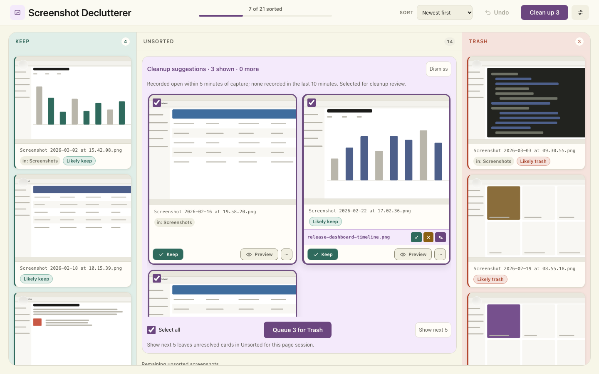
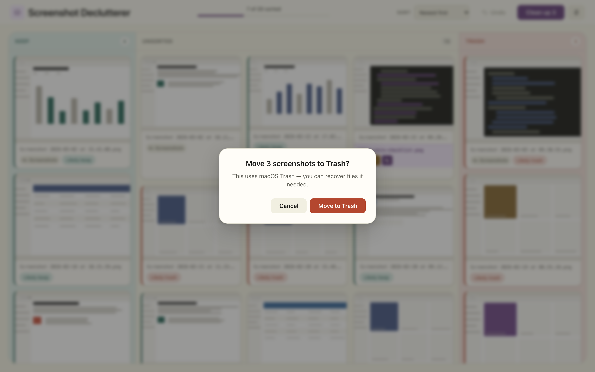

# Screenshot Declutterer

> A local-first macOS workspace for reviewing, renaming, and cleaning up screenshots.


<p align="center">
  
</p>

Screenshot Declutterer opens a local webpage and scans top-level screenshot files
on your Desktop, plus any folders you add in Settings. Review them as draggable
cards across **Keep**, **Unsorted**, and **Trash**. You can preview, rename,
multi-select, and batch-triage files before confirming cleanup.

When cleanup is confirmed, selected files move to the native macOS Trash, where
they remain recoverable. The app and its optional AI naming flow run locally;
screenshots are never uploaded to a cloud service.

The README screenshots use the repository's deterministic, non-personal demo
fixture. See the [full UI baseline](docs/assets/ui-baseline/README.md) for the
complete capture matrix.

## Features

- **Kanban triage** — drag cards between Keep, Unsorted, and Trash, or use the
  focused-card actions and keyboard shortcuts
- **Multi-select and batch actions** — select several cards and move the whole
  selection to Keep or Trash; selected cards can also be dragged as a group
- **Find similar screenshots** — **Identical** badges identify matching file
  bytes; **N similar** badges flag close visual matches. Select a badge to review
  that screenshot and its direct matches with the existing batch actions
- **Multiple sources** — Desktop is always included; add up to ten tracked
  folders from the native macOS folder picker, with source tags on cards
- **Optional local AI naming** — LiteRT-LM uses an on-device vision model to
  suggest safe filenames; accept, dismiss, or edit suggestions
- **Learned category hints** — past decisions produce subtle “Likely keep” or
  “Likely trash” suggestions without moving files automatically
- **Inline cleanup suggestions** — review screenshots with a recorded open
  within five minutes of creation and a last recorded open over ten minutes ago;
  preview, keep, or queue the selection for Trash inside Unsorted
- **Direct renaming** — rename from a card, a lightbox preview, or an AI
  suggestion; file extensions are preserved when appropriate
- **Full-size preview** — double-click a card or use Preview to open the
  lightbox, then browse with previous/next controls
- **Safe cleanup** — confirmation is required before files move to macOS Trash;
  partial failures are reported individually and do not erase successful state
- **Undo** — multi-level undo persists across a browser reload for the current
  session
- **Reveal in Finder** — open the selected screenshot's location directly in
  Finder on macOS
- **Responsive themes** — System, Light, and Dark modes, plus a compact
  one-column switcher for smaller windows
- **Local-first runtime** — Pillow thumbnails are cached locally, decisions and
  memory are small JSON files, and there is no build step or account
- **Multi-format scanning** — PNG, JPG, JPEG, TIFF, and BMP files matching
  `Screenshot*.*`

<p align="center">
  
</p>

## Cleanup suggestions

The **Cleanup suggestions** group appears above the remaining Unsorted cards
when filesystem creation time and Spotlight's recorded last-used time match the
timing rule. It works with the AI server stopped. Missing or ambiguous metadata
leaves files in the ordinary grid; Keep and Trash decisions always take priority.

Review five candidates at a time in the current sort order. The heading shows
the displayed and waiting counts; the explanation and controls stay visible as
the batch scrolls. Only displayed cards start selected. Unchecking changes
selection, not the file's decision. **Queue N for Trash** parks selected cards
in Trash; **Done** still requires confirmation before any file moves on disk.
Keep and Queue leave slots empty until you choose **Show next 5**. That button
returns unresolved cards to ordinary Unsorted and defers them for this page
session. Refresh preserves the batch and unchecked choices while reading fresh
activity. Undo restores current-batch cards; undoing a previous batch restores
ordinary Unsorted. **Dismiss** hides the group until the page reloads.

This signal describes the last recorded open, not a first-open history or proof
that a file was shared or is no longer needed. Creation time can also be affected
by copies and restores. Quick Look, uploads, and the app's own previews are not
established by this signal. See the [batch screenshots and verification matrix](docs/assets/cleanup-batches/README.md).

## Find similar screenshots

Matches are computed locally across Desktop and tracked folders, without an AI
server or additional dependencies. **Identical** means the original file bytes
have matching size and BLAKE2b-128 hashes. **N similar** means a conservative
visual comparison passed; different text can still look similar at this scale.
Preview candidates before deciding which copies to keep.

Each badge selects its screenshot and only the direct matches of that type.
It replaces the current board selection and temporarily uses the batch bar,
including when a match appears in Cleanup suggestions. **Keep**, **Trash**, drag,
and undo work as usual. Badge selection does not make decisions. **Done** remains
the confirmed disk operation. Refresh recomputes active matches and clears the
board selection; renames update match references immediately.

Image signals are cached in local memory records and revalidated after file
changes. First scans decode uncached images; unchanged scans reuse their signals.
Scrolls, crops, large overlays, and fine text differences are not reliably
distinguished. There is no clustering or semantic search. See the
[implementation design](docs/design-fe038-similar-screenshots.md) and
[synthetic browser evidence](docs/assets/similar-screenshots/README.md).

## Optional local AI naming

The AI feature is shipped and uses **LiteRT-LM**, not a cloud API. The default
model ID is `gemma4-e2b`. The core sorting workflow works normally when the
local AI server is unavailable.

To enable suggestions:

1. Install LiteRT-LM and import a compatible vision model with the ID
   `gemma4-e2b`.
2. Start the server with `litert-lm serve`, or use **Start local AI** from the
   Local AI section in Settings. The default server URL is
   `http://localhost:9379`.
3. Use **Suggest All** in Settings for new screenshots. The app shows progress
   and cancellation controls, then lets you accept, dismiss, or edit each
   result.

The Settings panel also supports a custom model ID and optional
**Auto-suggest on scan**. AI replies are normalized to safe filenames while
preserving the source image extension. If LiteRT-LM is stopped or unreachable,
Settings shows the server status and leaves the rest of the workflow available.

## Quick Start

```bash
git clone https://github.com/Collaboration95/screenshot-declutterer.git
cd screenshot-declutterer
make install
make run
```

Your browser opens automatically at `http://localhost:<port>` (default 5002,
auto-incremented if occupied).

For development dependencies and checks:

```bash
make dev
make check
```

## Environment Variables

| Variable | Default | Description |
|----------|---------|-------------|
| `SS_DCL_PORT` | `5002` (auto) | Override the server port. Set `0` to auto-detect. |
| `SS_DCL_DESKTOP` | `~/Desktop` | Directory to scan for Desktop screenshots. |
| `SS_DCL_HOME` | current home | Relocate app state, logs, and caches for an isolated runtime. |
| `THUMB_SIZE` | `800x600` | Thumbnail dimensions in `WxH` format. |
| `LITERT_BASE_URL` | `http://localhost:9379` | URL of the local LiteRT-LM server. |
| `LITERT_SERVE_CMD` | `litert-lm serve` | Command used by the in-app Start local AI action. |
| `FLASK_DEBUG` | `0` | Enable Flask debug mode (`1` to enable). |

## Keyboard Shortcuts

| Key | Action |
|-----|--------|
| `Arrow Left` | Move a focused Unsorted card to Keep; return a sorted card to Unsorted |
| `Arrow Right` | Move a focused Unsorted card to Trash; return a sorted card to Unsorted |
| `Enter` / `Space` | Toggle selection for the focused card |
| `Cmd/Ctrl + Z` | Undo the last move |
| `Esc` | Close a preview or modal, or clear the current selection |
| `Double-click` | Open a full-size preview |
| `←` / `→` in preview | Browse between screenshots |

## How It Works

1. **Scans** Desktop and configured tracked folders for top-level files matching
   `Screenshot*.*` with supported image extensions.
2. **Identifies** files with lightweight source-aware fingerprints and persists
   processing history in a local memory store.
3. **Serves** locally generated thumbnails through Flask; Pillow caches them by
   thumbnail size and refreshes stale files.
4. **Sorts** with a vanilla JavaScript drag-and-drop interface, multi-select,
   keyboard controls, and persisted Keep/Trash decisions.
5. **Suggests names** only when requested or enabled, by sending image data to
   the local LiteRT-LM server on the same Mac.
6. **Cleans up** through `send2trash`, which uses the native macOS Trash API
   instead of permanently deleting files.

## Local Data

By default, the app writes only local state:

- `~/.ss-dcl/state.json` — Keep/Trash decisions
- `~/.ss-dcl/memory.json` — fingerprinted file history, suggestions, and status
- `~/.ss-dcl/settings.json` — AI, theme, tracked-folder, and pruning settings
- `~/.ss-dcl/app.log` — rotating application log
- `~/.cache/ss-dcl/thumbs/<WxH>/` — generated thumbnail cache

The managed LiteRT-LM process writes its PID and log under `~/.ss-dcl/` as
well. Set `SS_DCL_HOME` to move this entire runtime tree to a throwaway
directory for demos or tests.

## Development

See [DEVELOPMENT.md](DEVELOPMENT.md) for the project layout, make targets, and
test commands. The project uses Flask, vanilla HTML/CSS/JavaScript, Pillow,
`send2trash`, Ruff, Pyright, and pytest with no frontend build step.

See [backlog-features.txt](backlog-features.txt) for proposed features and
future ideas, and [CHANGELOG.md](CHANGELOG.md) for shipped changes.

## License

MIT — see [LICENSE](LICENSE).
