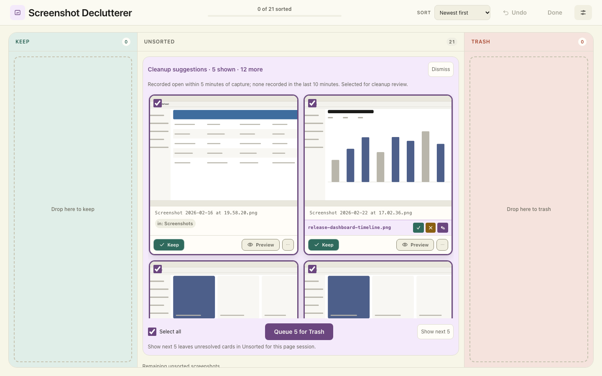
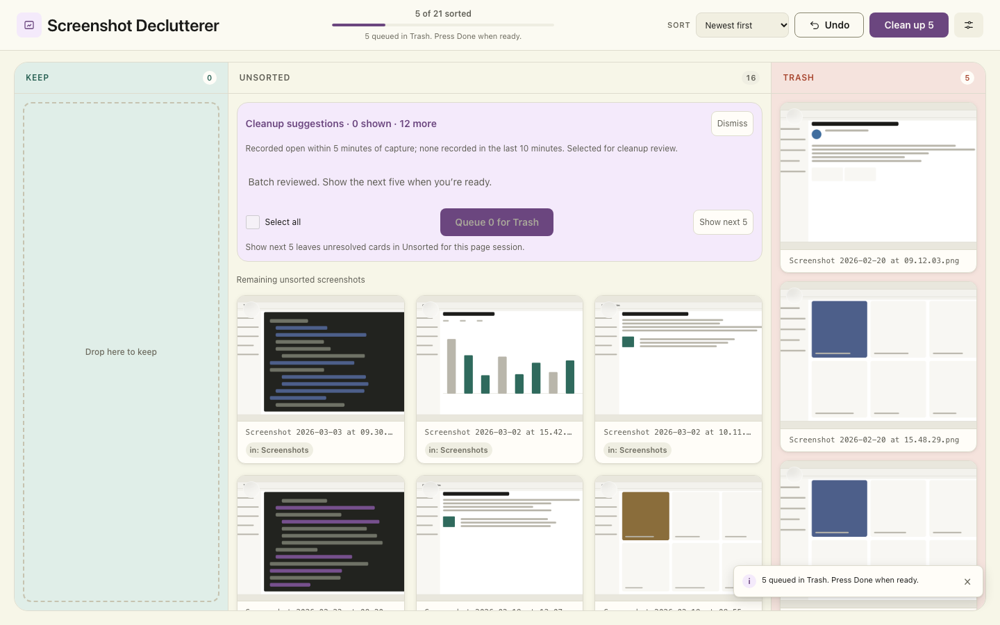
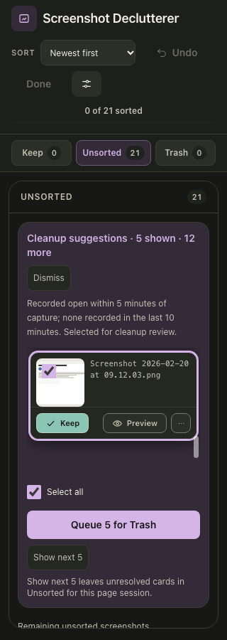

# Five-card cleanup batches — issue #120

Generated by `tools/check_cleanup_batches_ui.py` from the procedural demo fixture,
with 17 eligible screenshots among 21 files, an isolated Desktop and tracked folder,
and fixed activity timestamps at `2026-10-08T09:30:00+00:00`. Images contain no personal
content. The local AI server is offline; actual disk trash raises an assertion.

## Reproduce

```sh
uv run python tools/check_cleanup_batches_ui.py
uv run python tools/check_cleanup_ui.py
node --test 'tests/js/**/*.test.js'
uv run pytest
```

The browser tools require Chrome/Chromium (or `SS_DCL_CHROME`) and local port access.
They recreate their own `.cache` fixture directories and do not read real Desktop
files or Spotlight activity. Test-only metadata and helper routes run only in the
capture server.

## Screenshot matrix

| Layout | Light | Dark | Auto, light system | Auto, dark system |
| --- | --- | --- | --- | --- |
| Wide, 1440 × 900 | [View](1440x900-board-light.png) | [View](1440x900-board-dark.png) | [View](1440x900-board-auto-light.png) | [View](1440x900-board-auto-dark.png) |
| Compact, 1024 × 768 | [View](1024x768-board-light.png) | [View](1024x768-board-dark.png) | [View](1024x768-board-auto-light.png) | [View](1024x768-board-auto-dark.png) |
| Narrow, 320 × 900 | [View](320x900-board-light.png) | [View](320x900-board-dark.png) | [View](320x900-board-auto-light.png) | [View](320x900-board-auto-dark.png) |
| Narrow queue reached by Tab | [View](320x900-footer-light.png) | [View](320x900-footer-dark.png) | — | — |
| Wide, cards scrolled | [View](1440x900-scrolled-light.png) | [View](1440x900-scrolled-dark.png) | — | — |
| Narrow, cards scrolled | [View](320x900-scrolled-light.png) | [View](320x900-scrolled-dark.png) | — | — |

The heading, explanation, and queue controls occupy separate rows from the scrolling
cards. Geometry checks verify their visibility and the absence of card overlap.

| Flow state | Screenshot |
| --- | --- |
| Five displayed, twelve waiting | [Initial batch](1440x900-board-light.png) |
| Unchecked card deferred; next five displayed, seven waiting | [Next batch](1440x900-deferred-next-batch-light.png) |
| First five queued; zero displayed, twelve waiting; next remains available | [Completed batch](1440x900-batch-completed-light.png) |
| Fifteen queued; final two displayed, zero waiting | [Final batch](1440x900-final-two-light.png) |





## Verification

- Initial batch is the first five eligible files in the current sort order, with no confidence ranking.
- Waiting candidates stay ordinary Unsorted and outside cleanup selection.
- Select all, queue, and drag act only on displayed cards.
- Unchecking does not mark Keep or persist a decision.
- Keep/Queue vacate slots without filling; a completed batch retains context and Next.
- Explicit next defers unresolved cards for this page session without changing their decisions.
- Seventeen candidates produce 5 → 5 → 5 → 2; each appears exactly once.
- Queue never calls `/api/done`; existing confirmation and disk-trash boundaries remain intact.
- Refresh and sorting preserve membership and unchecked choices; rename preserves source identity.
- Current-batch undo restores the same slot. Earlier-batch undo restores ordinary Unsorted.
- Disappeared files and later recorded activity remove stale candidates without filling slots.
- Exhausted suggestions hide the section; undo restores the final batch.
- Last-open details and routine Desktop badges are absent; duplicate filenames retain source labels.
- No horizontal overflow across all themes/layouts; keyboard Queue remains reachable at 320px.
- Existing preview/focus, ordinary selection, AI hints, dismissal/reload, rename, and confirmation checks pass.

Python: **547 passed**, 5 opt-in tests deselected, **87.20% coverage** (85% gate).
JavaScript: **62 passed**, including six batch-state tests. Ruff, formatting,
Pyright, and JavaScript syntax checks pass. Browser: Chrome 154.0.8037.99;
[machine-readable evidence](verification.json) lists all 21 screenshots.
