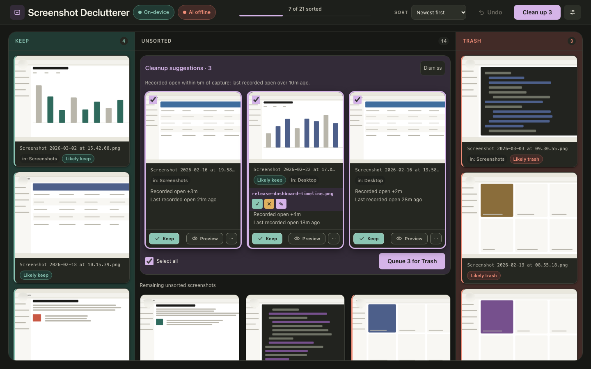

# Inline cleanup suggestions — issue #118

Generated by `tools/check_cleanup_ui.py` using the existing procedural demo images,
an isolated Desktop and tracked folder, and fixed usage metadata at
`2026-10-08T09:30:00+00:00`. The local AI server is deliberately offline.
No real Desktop, personal screenshot, real Spotlight activity, or disk trash is used.
The test-only metadata reader and helper routes exist only in the capture process.

The three candidates include identical filenames in Desktop and a tracked folder,
plus a card with an AI filename suggestion and a learned category hint.

## Reproduce

```sh
uv run python tools/check_cleanup_ui.py
```

Requires Chrome/Chromium; the existing capture harness discovers it or accepts
`SS_DCL_CHROME`. The tool recreates `.cache/cleanup-fixtures`, runs browser checks,
and writes these images and `verification.json`. Application startup and headless
Chrome require permission to bind local ports in sandboxed environments.

## Screenshot matrix

| Layout | Light | Dark | Auto, light system | Auto, dark system |
| --- | --- | --- | --- | --- |
| Wide, 1440 × 900 | [View](1440x900-board-light.png) | [View](1440x900-board-dark.png) | [View](1440x900-board-auto-light.png) | [View](1440x900-board-auto-dark.png) |
| Compact, 1024 × 768 | [View](1024x768-board-light.png) | [View](1024x768-board-dark.png) | [View](1024x768-board-auto-light.png) | [View](1024x768-board-auto-dark.png) |
| Narrow rows, 320 × 900 | [View](320x900-board-light.png) | [View](320x900-board-dark.png) | [View](320x900-board-auto-light.png) | [View](320x900-board-auto-dark.png) |
| Narrow footer, reached by Tab | [View](320x900-footer-light.png) | [View](320x900-footer-dark.png) | — | — |




## Verification

- No horizontal page overflow; review controls fit at every viewport and theme.
- Narrow footer scrolls into view and Queue is reachable with Tab.
- Candidates render once, retain scan order, and count as Unsorted.
- Identical names in separate sources retain separate identities and selections.
- Initial/all/partial/zero checkbox states; selection writes no decisions.
- Unchecked choices survive sorting, renaming, and rescanning.
- Cleanup and ordinary board selection have one active batch action area.
- Preview and Escape preserve review choices and restore focus.
- Keep, queue, drag, and per-card undo reuse existing moves and persistence.
- Queue excludes unrelated cards and never requests `/api/done`; Done still opens confirmation.
- Later recorded use removes stale suggestions; disappeared tracked files leave the board.
- Dismiss changes no decisions, survives refresh, and resets on page reload.
- Existing AI filename suggestions and learned category hints remain available.

The Python suite independently tests timing boundaries, timezone normalization,
creation-equivalent timestamps, missing/invalid birth time, unavailable indexing
signals, permission errors, malformed output, timeouts, unsupported platforms,
source containment, explicit Keep/Trash precedence, and fresh per-scan reads.

Verified with Chrome 154.0.8037.99; see [machine-readable capture details](verification.json).
Python verification: **547 passed**, **87.20% coverage** (85% required); new usage
module: **100% coverage**. Existing JavaScript suite: **56 passed**. Ruff, formatting,
Pyright, and the dependency audit pass.

The required audit initially found vulnerable transitive dependencies. The lockfile
updates urllib3, virtualenv (and its python-discovery dependency), and Werkzeug to
available fixed releases; the follow-up audit reports no known vulnerabilities.
